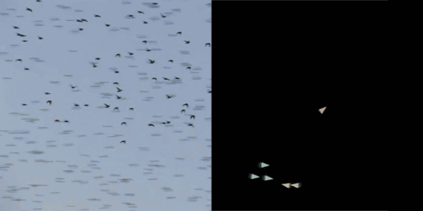
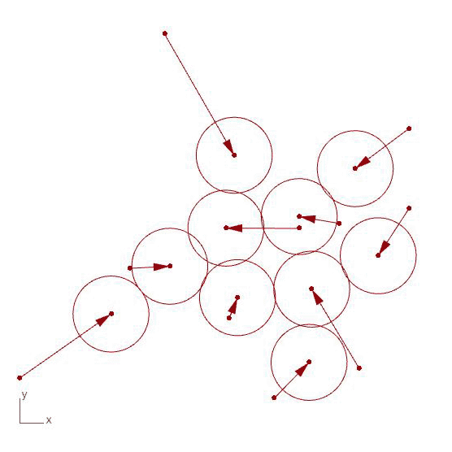
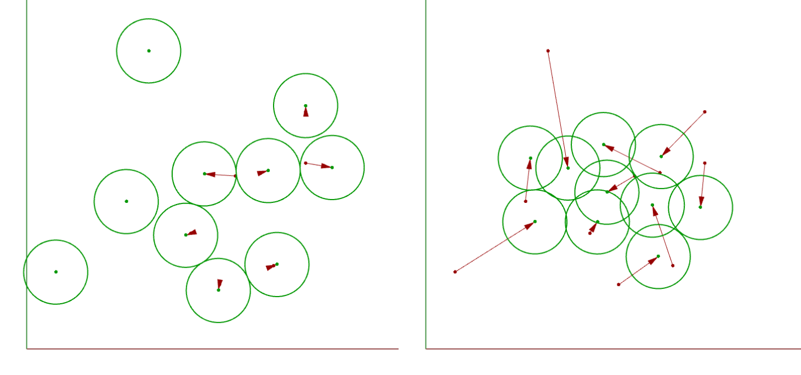

# Programming behavior

In this section we will explore the concepts of emergence and agent-based behavior and learn how we can program them in Python using dynamic and object-oriented programming.

## Introduction

Agent-based systems are often used to model complex behaviors in nature, which are also typically defined by the interaction of a large number of agents who are driven by a relatively simple set of rules. Examples of such systems include the flocking of birds, the organization of ants, the growth of slime mold, and the construction of termite mounds. These types of systems are often called _emergent_ because of their ability to develop highly complex behaviors and structures from a set of relatively simple behaviors.



To create such a system we define a collection of agents who follow a set of rules or behaviors over a series of time steps. These behaviors dictate how the agents interact with other agents and their environment, and how these interactions affect the internal state of the agents.

In computer science, such systems are often called agent-based models and we can easily implement them using Object-oriented programming (OOP). To do so we create a Class which defines the structure of the agent, with local _parameters_ that define its states and a set of _methods_ which define its behaviors. Then we create a set of instances of this Class and let the instances play out their behaviors over a series of time steps. Because such a system has to play out over multiple time steps, it is called a _dynamic system_, as opposed to _static systems_ which can be computed directly in one step.

## Space Packing Tutorial

In this tutorial, you will use object-oriented and dynamic programming to implement an agent-based system for packing a set of circles in a plane.



| Files you will need for this tutorial |
| :------------------------------------ |
| [3_start.gh](data/3_start.gh)         |

To start, open the file above within a new Rhino document. In the model, the first set of Grasshopper components create a list of points based on parameters created by a `Gene Pool` component. These points are input into a Python component that contains a script defining a single class called `Agent` that has the following properties and methods:

<u>Properties</u>

- _cp_ - The center point of the agent
- _radius_ - The radius of the circle representing the agent

<u>Methods</u>

- _collide()_ - This is the main behavior method which identifies if another instance of the agent Class overlaps with it and if so moves both itself and the other agent away from each other. The distance the agents are moved is the amount of their overlap multiplied by a value alpha (within the range 0.0-1.0) which controls the extent to which each agent moves at each time step.
- _get_circle()_ - This is a utility method which returns a circle defined by the agent's center point and radius which can be used to visualize the agents in Grasshopper

The main body of the code first defines an empty list called `agents` which will store all the instances we will create of the `Agent` class. We then loop over all the points coming in through the `pts` input, and for each point create a new instance of the `Agent` class with that point as the agent's center point. We are also passing the `radius` input into the constructor to set the radius parameter for each instance. Once created each instance is then added to the `agents` list using the list's `.append()` method.

```python
agents = []

for pt in pts:
    my_agent = Agent(pt, radius)
    agents.append(my_agent)
```

In the next block of code, we have a nested set of three loops. The first loop creates an iterator up to the `max_iters` parameter which controls the maximum number of times the dynamic system will run. Within each iteration (or time step), the next two loops iterate over each agent twice, so that each agent has a chance to interact with another agent in the system. Once we confirm that the two agents are not the same (using Python's helpful `is` and `not` operators), we run the `.collide()` method from one agent to the other.

```python
for i in range(max_iters):
    for agent_1 in agents:
        for agent_2 in agents:
            if agent_1 is not agent_2:
                agent_1.collide(agent_2)
```

{: .note }

> Using these two loops and a conditional statement is one way to check each agent against every other while ensuring that the agents are not the same. Another way is to alter the second loop so that we only look at the agents 'after' the current agent in the list:
>
> ```python
> for i in range(max_iters):
>     for j,agent_1 in enumerate(agents):
>         for agent_2 in agents[j+1:]:
>             agent_1.collide(agent_2)
> ```
>
> A nice side-effect of this is that each pair will only be considered once during each time step, and it saves the effort of checking if the two agents are the same, since we are picking `agent_2` from a subset of the `agents` list starting at the index of the first agent (j) plus 1.

After running this set of loops the agents should be in their final positions. At this point, we can iterate over the `agents` list one more time and get the circle representing each agent so we can output it back to Grasshopper and visualize it in Rhino. The Grasshopper script also contains components to visualize the movement vectors from the agent's initial to final positions.

```python
circles = []

for agent in agents:
    circles.append(agent.get_circle())
```

{: .challenge-title }

> Challenge 1: Implement cluster method
>
> So far, the `Agent` class implements one behavioral method called `collide()` which checks the distance between two instances of the class and moves them away from each other if they are too close. For this challenge, implement a complementary method called `cluster()` which will move the object closer to a specified 'neighbor' object.
>
> To implement the challenge, first replace the code in the Python component with that at the bottom of this section. This code implements some additional features as described below. You can also use [this file](data/3_challenge_start.gh) as a starting point which has the code changes already implemented. Then, replace the `pass` keyword in the `cluster()` method of the `Agent` class with code to enable the clustering behavior between two objects. After you’ve properly completed the method, you should see the objects cluster together in the viewport. This is driven by the objects trying to move closer to their neighbors, while still avoiding overlaps due to the `collide()` method:
>
> 
>
> Hint: The `cluster()` method should be very similar to the `collide()` method, with a few minor differences:
>
> - After measuring the distance between center points, the movement behavior should be triggered if the distance is **greater than** the sum of radiuses.
> - The vector for moving the objects should be based on the gap between them (the distance minus the sum of radii) instead of the overlap (sum of radii minus the distance)
> - Based on how you calculate the initial vector, make sure that you are moving the right object in the right direction so that the objects end up moving **toward** each other.

{: .challenge-title }

> Challenge 2: Implement stopping condition
>
> Right now the main loop will run for the number of iterations set by the `max_iters` parameter. However, we have no way of knowing if this is too many iterations to run or not enough based on how we want the circles to pack.
>
> For this challenge, can you implement a stopping condition to terminate the iteration loop if the agents did not move a sufficient amount in the previous iteration? This will cause the process to end once the circles are near their neighbors without overlapping. Once you've implement the stopping condition you should be able to increase the `max_iters` to a much larger value (for example 1000) so that the loop can run for longer if it needs to before the stopping condition is met.
>
> Note: even if you've implemented a stopping condition it is still important to have a parameter like `max_iters` to make sure the loop will eventually end even if the stopping condition is never met. If you don't do this you run the risk of creating an infinite loop that will cause your Python (and with it Grasshopper and Rhino) to freeze and eventually crash 💥.

The code below implements some additional features to make it easier for you to implement the challenges:

- `Line 10`: When an object is initialized, an empty list called “neighbors” is created to store the object’s neighbors.
- `Line 13`: An addNeighbor() method has been implemented in the Room class which adds a given object to the instance’s list of neighbors.
- `Line 35`: An empty method called cluster() has been created. The method contains a single line with the pass keyword which will do nothing but is necessary so that the code does not throw an error due to an empty method. This is where you will implement the object’s cluster behavior for this week’s challenge.
- `Line 48`: A loop has been added which iterates over each room object and uses its addNeighbor() method to add the previous room in the list to it’s list of neighbors.
- `Line 58`: Within the optimization loop which runs the collision behavior for each pair of rooms, another loop has been added to run the “cluster” behavior for each room and its neighbors.

Once you're done implementing the challenges, paste your final code into the code block below and create a pull request on this page called `3-your_uni` (for example `3-dn2216`).

```python
import Rhino.Geometry as rh

class Agent:

    def __init__(self, pt, r):

        self.cp = pt
        self.radius = r
        self.neighbors = []

    # method for adding another instance to a list of neighbors
    def add_neighbor(self, other):
        self.neighbors.append(other)

    # method for checking distance to other room object and moving apart if they are overlapping
    def collide(self, other):

        d = self.cp.DistanceTo(other.cp)

        if d < self.radius + other.radius:

            pt_2 = other.cp
            pt_1 = self.cp

            # get vector from self to other
            v = pt_2 - pt_1

            # change vector magnitude to 1
            v.Unitize()
            # set magnitude to half the overlap distance
            v *= (self.radius + other.radius - d) / 2
            # multiply by alpha parameter to control
            # amount of movement at each time step
            v *= alpha

            # move other object
            t = rh.Transform.Translation(v)
            pt_2.Transform(t)

            # reverse vector and move self same amount
            # in opposite direction
            v.Reverse()
            t = rh.Transform.Translation(v)
            pt_1.Transform(t)

    # method for checking distance to other instance and moving closer if they are not touching
    def cluster(self, other):

        pass

    def get_circle(self):
        return rh.Circle(self.cp, self.radius)

agents = []

for pt in pts:
    my_agent = Agent(pt, radius)
    agents.append(my_agent)

# for each agent in the list, add the previous agent as its neighbor
for i in range(len(agents)):
    agents[i].add_neighbor(agents[i-1])

for i in range(max_iters):
    for j,agent_1 in enumerate(agents):

        # cluster to all agent's neighbors
        for agent_2 in agent_1.neighbors:
            agent_1.cluster(agent_2)

        # collide with all agents after agent in list
        for agent_2 in agents[j+1:]:
            agent_1.collide(agent_2)

circles = []

for agent in agents:
    circles.append(agent.get_circle())
```
