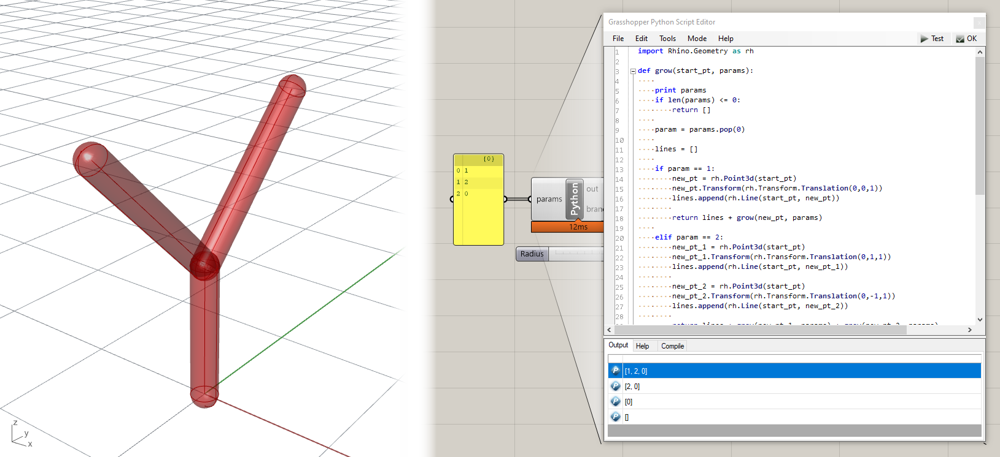
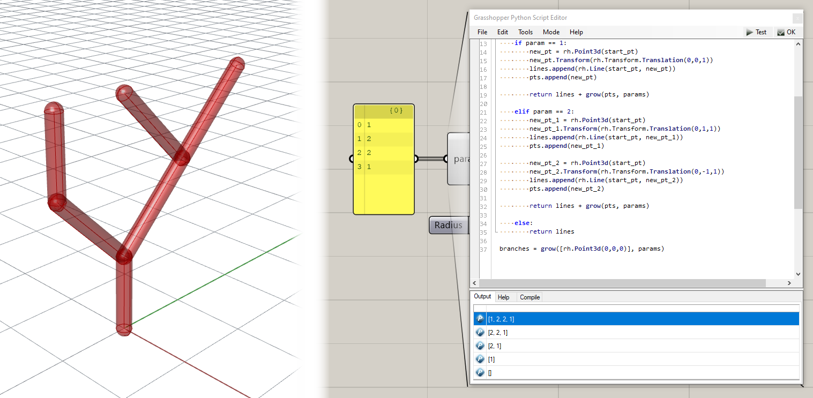

# Recursive Systems

In this section we will explore the concept of recursive systems, see how we can program them with Python, and work through a couple of examples including creating a branching tree and subdividing a space into multiple spaces.

## Introduction

In computer science, _recursion_ refers to a strategy where the solution to a problem can be solved using solutions to smaller versions of the same problem. In computer programming, such systems are defined using _recursive functions_ which are functions that can call themselves. These kinds of functions are impossible to define in Grasshopper because there is no way to feed data from a component back into itself. Using Python, however, we can easily create such functions by having the function define its output based on the outputs of modified versions of itself.

These _recursive_ calls to the same function create a kind of spiral behavior defined by subsequent executions of different versions of the same function. By default this recursive behavior will create an infinite spiral - if you don't provide any way for the recursion to stop, the function will keep calling itself for eternity, which will simply cause your script to crash. We can prevent this by defining a conditional inside the function that specifies a _termination criteria_ which stops the function from calling itself. Once the final function call has terminated, its return is fed all the way back through all the function calls until the final solution is returned.

### Coding recursive functions in Python

The concept of recursion is incredibly powerful, and there are many useful application for recursion in computer programming. At the same time, the nested behavior of recursive functions can be difficult for people to understand intuitively, which is why recursion tends to be a difficult subject for people just starting out in programming. To start to gain an intuition for how recursive functions work, let's create a simple example of a recursive function that can add a sequence of numbers up to a certain value. We won't be using any geometry yet, but you can try this code directly in a `Python` component in Grasshopper:

```python
def addRecursively(value):
    if value == 0:
        return value
    return value + addRecursively(value-1)

print addRecursively(3)
# prints 6
```

If you run this script you should see 6 as the result in the output window, which is indeed the result of summing 1 + 2 + 3. You can see that `addRecursively()` is a recursive function because it calls itself within its definition. To see how this function works, let's step through all of the function calls that lead to the final solution.

The first time we call the function we pass in the number three, which is brought into the function in the variable 'value'. The function first checks if this value is equal to 0, and if it is it simply returns the value. This causes the function to return 0 if its input is 0, which is a valid solution to our summation problem. This conditional is the 'termination criteria' of our function. In order for our function to not enter an endless spiral and crash, we have to ensure that this criteria is met at some point. In our case we must ensure that the value input into the function eventually becomes 0.

In our case the value is '3' so the conditional is skipped, and the function instead returns the input value added to the results of the same function with an input of one minus the value. This causes the function to execute again, this time with an input of '2'. The original function will now wait until it gets the return from this new function, at which point it will return the value of the new function plus 3.

To get a better understanding of how this works, let's visualize the sequence of calls and returns:

```
addRecursively(3) --> 3 + _
	addRecursively(2) --> 2 + _
		addRecursively(1) --> 1 + _
			addRecursively(0) --> 0
			1 + 0 --> 1
		2 + 1 --> 3
	3 + 3 --> 6
```

You can see how this forms a nested set of calls to the same function, with each function waiting for its child function to return its value before generating its own return. You can also see that, since we are always subtracting one from the value before calling the function recursively, it is guaranteed that the value will eventually reach 0, no matter how large of a value we start with.

{: .note }
While this logic should work for all positive integers (what we could call the "happy case"), we should also make sure it would work with other possible inputs the user might provide, for example negative or decimal numbers. For an extra challenge you could test running the function with different types of inputs and modify the termination criteria as needed to ensure the recursive calls will still eventually exit.

### Recursing over a list

Let's modify our recursion script to sum an arbitrary list of numbers. To do this we can modify the `addRecursively()` function to take in a list of numbers and operate on them one by one:

```python
def addRecursively(values):
    if len(values) <= 0:
        return 0
    value = values.pop(0)
    return value + addRecursively(values)

print addRecursively([1,3,5])
# prints 9
```

In this case the input into the `addRecursively()` function is a list of values. The termination criteria is when there are no more items in the list, at which point the function returns 0. If there are still items remaining, the function uses the list's `.pop(i)` method which removes the i-th element from the list and stores it in the 'value' variable. Then the function returns this value added to the return of the same function called with the new version of the list which has the first value removed. We can visualize this behavior in the same way as before:

```
addRecursively([1,3,5]) --> 1 + _
	addRecursively([3,5]) --> 3 +
		addRecursively([5]) --> 5 + _
			addRecursively([]) --> 0
			5 + 0 --> 5
		3 + 5 --> 8
	1 + 8 --> 9
```

We can use this list-based method of recursion to parameterize the behavior of any recursive function with a list of parameters. In the addition case, the numbers in the list can be thought of as parameters that control the behavior of the addition over time. In the same way, we can imagine a set of parameters which control the behavior of any recursive function that is executed the same number of times as there are parameters.

## Branching Tutorial

In this tutorial we will explore recursive algorithms hands-on to create a branching model of tree. Branching systems and other [fractal geometries](http://users.math.yale.edu/public_html/People/frame/Fractals/) are commonly represented through recursive functions because they are self-similar, meaning that the same behavior is exhibited at various scales throughout the structure. For example, the branching of a set of large branches from the trunk of a tree is similar to the branching of a smaller set of branches from each of these branches.

| Files you will need for this tutorial |
| :------------------------------------ |
| [2_start.gh](data/2_start.gh)         |

To start, open the file above in within a new Rhino document. This file includes a basic setup for reading in a list of parameters from a 'Panel' component and outputting a list of lines representing branches in a tree. The lines are then thickened using a `Pipe` component so we can see them easier in the Rhino viewport. The `Python` component includes the code below for generating the branching structure:

```python
import Rhino.Geometry as rh

def grow(start_pt, params):

    if len(params) <= 0:
        return []

    param = params.pop(0)

    lines = []

    if param == 1:
        new_pt = rh.Point3d(start_pt)
        new_pt.Transform(rh.Transform.Translation(0,0,1))
        lines.append(rh.Line(start_pt, new_pt))

        return lines + grow(new_pt, params)

    elif param == 2:
        new_pt_1 = rh.Point3d(start_pt)
        new_pt_1.Transform(rh.Transform.Translation(0,1,1))
        lines.append(rh.Line(start_pt, new_pt_1))

        new_pt_2 = rh.Point3d(start_pt)
        new_pt_2.Transform(rh.Transform.Translation(0,-1,1))
        lines.append(rh.Line(start_pt, new_pt_2))

        return lines + grow(new_pt_1, params) + grow(new_pt_2, params)

    else:
        return lines

branches = grow(rh.Point3d(0,0,0), params)
```

This code sequentially generates a branching structure based on a set of parameters which can be 0, 1, or 2. The `grow()` function takes in a starting point and creates zero, one, or two new branches based on the first parameter in a set. It then calls the `grow()` function again with the end of each new branch as the starting point and the reduced parameter list. The output of the grow function is a list of lines representing the branches. Let's step through the function calls using an example set of parameters [1,2,0] to see how it works.

The first time we call the grow function we pass in a new point at the origin [0,0,0] along with the full set of parameters. At this point, the length of the parameter list is 3, so the termination criteria is not met and the function continues. Next the function pops the first parameter from the list and stores it in the `param` variable. It also creates an empty list called 'lines' to store the geometry of the branches it creates.

Now the function encounters a set of conditionals which do different things depending on the value of the current parameter. If the parameter value is '1' it makes one new branch by creating a new point as a copy of the start point:

```python
new_pt_1 = rh.Point3d(start)
```

It then moves that point one unit in the z direction to create a vertical branch:

```python
new_pt_1.Transform(rh.Transform.Translation(0,0,1))
```

It then creates a new line between the start and new point and appends it to the lines list:

```python
lines.append(rh.Line(start, new_pt_1))
```

Finally, it returns this set of new lines, added to the set of lines from the next call to `grow()`, which takes in the new point as its starting point and the reduced set of parameters.

The behavior for a parameter value of '2' is similar except we now create two diagonal branches instead of one vertical one and call the `grow()` function twice in the return statement. At first it might seem that calling the function twice in one line would pass the same parameter values to both new branches, so that we would end up with more branches that starting parameter values. In fact, when we use variable names in Python we are actually using references to the data stored somewhere in memory, which means that all the function calls are actually interacting with the same exact list. This means that when one function pops a value out of the list, the list is affected for all subsequent functions, even if they are called later on the same line.

In this example the first call to the `grow()` function pops one of the parameters from the list so it is already reduced when the second `grow()` function is executed later in the line. In this case this is what we want since we only want each parameter to be considered once. If we actually wanted to pass the same exact parameter list to both function calls we would first have to make a copy of the list. To make sure each parameter is only being used once we can print the values in the parameter list at the beginning of each function call:



The final conditional in the function is an `else` statement that captures any other possible parameter value and results in the return of an empty list. This includes the parameter 0 which we expect to terminate the branching procedure. Although we could have programmed the behavior for our expected inputs of 0, 1, and 2 through their own explicit conditionals, it is good practice to nest all of the conditions together using `elif` statements and have a final `else` condition at the end to capture all other cases. This provides a fail-safe termination condition that ensures that the recursive function will always terminate even if you enter an unexpected value by accident.

For our parameter set of [1,2,0], the first call to `grow()` generates one vertical branch and calls `grow()` again. The second call creates two diagonal branches and calls `grow()` two more times. The first of these calls returns an empty list because the parameter is '0'. The second call also returns an empty list because there are no more parameters in the list. This results in the structure seen above. Here are some other possible structures based on different sets of input parameters. Note that the '0' parameter has the effect of stopping any branching path, so any sequence starting with '0' will produce no branches since the behavior is stopped at the first step.


### Stack vs. Queue

You may have noticed when testing the branching model with different inputs that the trees tend to be rather lopsided. If you analyze what's going on, you will notice that every time the tree branches, the first branch is used for further branches, causing the tree to lean in the direction of the first branch. This is due to the way we built our algorithm, specifically the part that creates to branches. After we create the new points on lines 20 and 24, we immediately use them to make two recursive calls to the `grow()` function. Because we execute these two calls sequentially, the first one takes precedent, _as well as all the further calls to `grow()` made by it_. This means that the last branch created always takes priority for generating the next branches, which results in rather tall but lop-sided trees.

We refer to this kind of an approach as _depth-first_, meaning deeper branches are explored first before closer ones. This concept also appears in other areas of computer science including [search](). In programming, we can apply a depth-first approach using a data structure known as a **stack**. A stack is a list to which elements are added to the front, as well as taken from the front. This means that the item taken from the stack is always the _most recent_ item added to it. You can think of this as a stack of books, where if you wanted to read a book you would have to take the one on the top, which was the most recently added. This kind of structure is also referred to as "last in, first out".

Here is a basic implementation of a stack in Python:

```python
my_list = [] 		# create empty list

# stack
my_list.append(“item”)	# add item to end of list
my_list.pop()		# take item from end of list. This is the default behavior of the .pop() method
```

A **queue**, on the other hand, adds elements to the end of a list, while still taking them from the front. This means that the item taken from the queue is always the _oldest_ item added to it. THis is similar to a queue of people lining up to buy tickets. The next person who gets to buy a ticket should be the person who joined the line earliest. A queue can be used to implement a _breadth-first_ approach, where branches are explored in order, generating a shallower but wider tree. This kind of structure is also referred to as "first in, first out".

Here is a basic implementation of a queue in Python:

```python
my_list = [] 		# create empty list

# queue
my_list.append(“item”)	# add item to end of list
my_list.pop(0)		# take item from start of list. We pass 0 into the .pop() method to pop the first item in the list
```

{: .note }
Notice that both stacks and queues can be represented using a list in Python. The only difference is which direction we take the item from.

Event though we are not using lists in our current implementation of the `grow()` function, the way we are executing subsequent calls to the function with the most recently generated points creates a similar depth-first behavior. To change this to a breadth-first approach where the earliest generated points are used to grow subsequent branches, we can modify our algorithm to store a list of generated points in a queue, with each generated point added to the end of the queue, and each subsequent call to the `grow()` function taking the oldest point from the front of the list.

Here is a breadth-first version of the same branching code, which makes the branching behave in a more intuitive way:

```python
import Rhino.Geometry as rh

def grow(pts, params): ## input to the grow() function is now a list of points

    if len(params) <= 0:
        return []

    param = params.pop(0)
    start_pt = pts.pop(0) ## the point used for branching is now the first point taken from the list

    lines = []

    if param == 1:
        new_pt = rh.Point3d(start_pt)
        new_pt.Transform(rh.Transform.Translation(0,0,1))
        lines.append(rh.Line(start_pt, new_pt))
        pts.append(new_pt) ## the new point is added to the list of points

        return lines + grow(pts, params) ## the function is called again with the updated list of points

    elif param == 2:
        new_pt_1 = rh.Point3d(start_pt)
        new_pt_1.Transform(rh.Transform.Translation(0,1,1))
        lines.append(rh.Line(start_pt, new_pt_1))
        pts.append(new_pt_1) ## the new point is added to the list of points

        new_pt_2 = rh.Point3d(start_pt)
        new_pt_2.Transform(rh.Transform.Translation(0,-1,1))
        lines.append(rh.Line(start_pt, new_pt_2))
        pts.append(new_pt_2) ## the new point is added to the list of points

        return lines + grow(pts, params) ## the function is called again with the updated list of points
        ## note that we can now call the function just once, since the important part for the branching is
        ## adding the two new points to the end of the list. With this queue-based approach, each call of the
        ## function just consumes another parameter using oldest point in the list.

    else:
        return lines

branches = grow([rh.Point3d(0,0,0)], params) ## passing the starting point as the single item in a new list
```



| Final files from this tutorial |
| :----------------------------- |
| [2_end.gh](data/2_end.gh)      |

{: .challenge-title }

> Challenge 1
>
> Download this [Grasshopper file](data/2_challenge_start.gh) which contains the breadth-first version of the branching code. Can you add additional code within the queue-based Python script to define a new branching behavior for the `3` parameter that creates the branching seen in the screenshot below. You should only add code within the `elif param == 3:` code block starting on line 36 of the Python script. You should not need to modify anything else about the code, the Grasshopper definition, or the set of parameters.
>
> 

Once you're done implementing this challenge, paste your final code below. Once you've finished all changes on this page, create a pull request on this page called `2-your_uni` (for example `2-dn2216`).

```python
import Rhino.Geometry as rh

def grow(pts, params):
    
    if len(params) <= 0:
        return []
    
    param = params.pop(0)
    start_pt = pts.pop(0)
    
    lines = []
    
    if param == 1:
        new_pt = rh.Point3d(start_pt)
        new_pt.Transform(rh.Transform.Translation(0,0,1))
        lines.append(rh.Line(start_pt, new_pt))
        pts.append(new_pt)
        
        return lines + grow(pts, params)
    
    elif param == 2:
        new_pt_1 = rh.Point3d(start_pt)
        new_pt_1.Transform(rh.Transform.Translation(0,1,1))
        lines.append(rh.Line(start_pt, new_pt_1))
        pts.append(new_pt_1)
        
        new_pt_2 = rh.Point3d(start_pt)
        new_pt_2.Transform(rh.Transform.Translation(0,-1,1))
        lines.append(rh.Line(start_pt, new_pt_2))
        pts.append(new_pt_2)
        
        return lines + grow(pts, params)
    
    elif param == 3:
        new_pt_3 = rh.Point3d(start_pt)
        new_pt_3.Transform(rh.Transform.Translation(1,0,1))
        lines.append(rh.Line(start_pt, new_pt_3))
        pts.append(new_pt_3)
        
        new_pt_4 = rh.Point3d(start_pt)
        new_pt_4.Transform(rh.Transform.Translation(-1,0,1))
        lines.append(rh.Line(start_pt, new_pt_4))
        pts.append(new_pt_4)
        
        
        return lines + grow(pts, params)
        
        ### ADD CODE HERE TO DEFINE BEHAVIOR FOR THE PARAMETER '3' ###
        
        
        return lines
    
    else:
        return lines

branches = grow([rh.Point3d(0,0,0)], params)
```

## Subdivision tutorial

| Files you will need for this tutorial   |
| :-------------------------------------- |
| [2_subd.3dm](data/2_subd.3dm)           |
| [2_subd_start.gh](data/2_subd_start.gh) |
| [2_subd_end.gh](data/2_subd_end.gh)     |

The previous example shows the power of recursive functions in defining complex forms based on a small set of abstract parameters. However, the use of recursion is not restricted only to branching problems. In fact any system can be implemented using recursive functions as long as it can be described based on smaller versions of itself. This exercise uses a similar recursive approach to divide a space into several smaller spaces. Download the Rhino and Grasshopper files above and you should see something similar to this:


The Grasshopper file specifies the inputs needed by the Python script and connects them to inputs on the `Python` component. The inputs are:

- <u>boundary</u> - A closed curve that represents the boundary of the space to be divided.
- <u>dirs</u> - A set of parameters either 0 or 1 `[0,1]` that define the direction of each split. The number of parameter sets the number of times the split occurs, and the number of spaces resulting will always be one more than the number of splits. To specify the parameters we use a `Gene Pool` component which bundles up a set of sliders of the same type to make it easier to specify a long list of parameters. For this parameter set, since we are looking for integers either 0 or 1, we set the range of the sliders to 0.00 to 1.99 and round the result down. This ensures an even distribution of both parameter values and works better than integer sliders.
- <u>params</u> - A set of parameters between 0 and 1 `[0-1]` that define the relative position of the splitting line for each division. The number of parameters defined here should match the number defined for <u>dirs</u>.

Inside the `Python` script you will find two functions already defined:

- `split_curve()` - Splits a curve with another curve. This combines RhinoCommon's Intersect and Split functions into one step and also handles a special case for non-convex boundaries.
- `split_space()` - For splitting a closed curve defining the boundary of a space into two closed curves based on two parameters, one which determines the direction of the split (horizontal or vertical) and one that determines the position of the split. This function utilizes the `split_curves()` function inside of it.

Currently, the boundaries are directly output to the curves output. What we need to do is write another function called `split_recursively` which calls the `split_space()` function recursively to progressively subdivide the input space into a set of smaller spaces. Then we can call this function with our initial boundaries and parameter sets to perform the subdivision. Here is the final script once the function is implemented:

```python
import Rhino.Geometry as rh
from scriptcontext import doc

# get absolute and angle tolerances from document
abs_tol = doc.ModelAbsoluteTolerance
ang_tol = doc.ModelAngleToleranceRadians


# this function splits a curve c1 with another curve c2
def split_curve(c1, c2, close):
    # get intersection events between two curves
    inter = rh.Intersect.Intersection.CurveCurve(c1, c2, abs_tol, abs_tol)
    
    # get parameters on first curve from all intersection events
    # this code uses a "list comprehension" which is a shortcut for iterating over a list in Python
    # this single line does the same thing as:
    
    # p = []
    # for i in range(inter.Count):
    #    p.append(inter[i].ParameterA)
     
    p = [inter[i].ParameterA for i in range(inter.Count)]
    
    # handle multiple intersections (for non-convex boundaries)
    
    # if more than two parameters are returned, it means that the boundary shape is non-convex
    # and was split by the split line into more than two pieces
    # since we only want two pieces, we must find two consecutive parameters 
    # which split the boundary into only two separate pieces
    
    if len(p) > 2:
        
        # loop over all parameters
        for i in range(len(p)):
            
            # get the points at the previous and current parameters in the list
            pt1 = c1.PointAt(p[i-1])
            pt2 = c1.PointAt(p[i])
            
            # get the line between the two points
            l = rh.Line(pt1, pt2).ToNurbsCurve()
            
            # check how many times the line intersects the boundary
            inter = rh.Intersect.Intersection.CurveCurve(c1, l.ToNurbsCurve(), abs_tol, abs_tol)
            
            # if there are only two intersections, return the two parameters 
            # and break out of loop
            if len(inter) == 2:
                p = [p[i-1], p[i]]
                break
    
    # split the curve by the parameters
    pieces = c1.Split(p)
    
    # create a new list to store the final curves
    curves = []
    
    # iterate over pieces
    for piece in pieces:
        # if closed curves were requested and the curve is not closed
        if close == True and not piece.IsClosed:
            # create a new line to close the curve, join them together, and add the result to curves list
            line = rh.Line(piece.PointAtStart, piece.PointAtEnd).ToNurbsCurve()
            curves += rh.NurbsCurve.JoinCurves([piece, line])
        else:
            # otherwise add the original piece to the curves list
            curves.append(piece)
    
    # return the final curves
    return curves

# this function splits a space with two parameters
def split_space(curve, dir, rot, param):
    
    # get the bounding box of the curve
    bb = curve.GetBoundingBox(True)
    # get the base point of the bounding box
    base_pt = rh.Point3d(bb.Min.X, bb.Min.Y, 0.0)
    
    # get the x and y dimensions of the bounding box
    x = bb.Max.X - bb.Min.X
    y = bb.Max.Y - bb.Min.Y
    
    # create a list of the x,y dimensions and x,y unit vectors
    dims = [x,y]
    vecs = [rh.Vector3d(1,0,0), rh.Vector3d(0,1,0)]
    
    # create a vector to position the split line based on the two parameters
    vec_1 = vecs[dir] * dims[dir] * param
    
    # copy the base point
    new_pt_1 = rh.Point3d(base_pt)
    # move the new point according to the vector
    new_pt_1.Transform(rh.Transform.Translation(vec_1))
    
    # calculate the opposite of the dir parameter
    # if the parameter is 0 this results in 1, if 1 then 0
    other_dir = abs(dir-1)
    
    # create a vector in the other direction the full extent of the bounding box
    vec_2 = vecs[other_dir] * dims[other_dir]
    
    # create a copy of the moved point
    new_pt_2 = rh.Point3d(new_pt_1)
    # move the point to define the other end point of the split line
    new_pt_2.Transform(rh.Transform.Translation(vec_2))
    
    # create the split line and convert it to a Nurbs Curve
    # (this is necessary to make the splitting work in the next function)
    split_line = rh.Line(new_pt_1, new_pt_2).ToNurbsCurve()
    
    # In order to rotate lines, first find center point of lines for Rh.transform.Rotation
    sl_length = rh.Line(new_pt_1, new_pt_2).Length
    sl_mid = rh.Line(new_pt_1, new_pt_2).PointAtLength(sl_length/2)
    
    # Test this is working
    print(sl_mid)
    
    # Rotate the lines by rot
    split_line.Transform(rh.Transform.Rotation(rot,sl_mid))
    
    # use the split_curve() function to split the boundary with the split line
    parts = split_curve(curve, split_line, True)
    
    # return the curves resulting from the split
    return parts

def split_recursively(curves, dirs, params):
    
    # Terminating condition
    if len(dirs) <= 0 or len(params) <= 0:
        return curves
        
    curve = curves.pop(0)
    d = dirs.pop(0)
    p = params.pop(0)
    r = rots.pop(0)
    
    # Process data
    new_curves = split_space(curve, d, r, p)
    curves += new_curves
    
    # Call function again: recursion
    return split_recursively(curves, dirs, params)

curves = split_recursively([boundary], dirs, params)

```

{: .challenge-title }

> Challenge 2
>
> Our subdivision script is nice but it is quite constrained because it can only split the space either horizontally or vertically. Can you change the functionality of the `split_space()` function to split the space on an arbitrary angle instead of choosing one of two directions?
>
> HINT: You can use [this file](data/2_subd_challenge.gh) as a starting point, which changes the dir input from a binary [0,1] to a continuous range [0-1]. In the script, you can map this range to a full rotation by multiplying it by `360` (if you want to use degrees) or `2*pi` if you want to use radians. Then you can use this rotation parameter to rotate the split line which divides the space.

Once you're done implementing the challenges, paste your final code into the code block above and create a pull request on this page called `2-your_uni` (for example `2-dn2216`).
