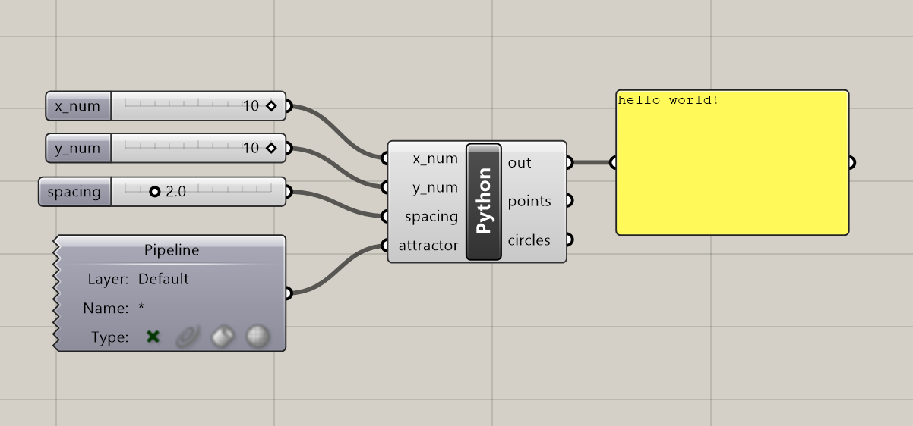
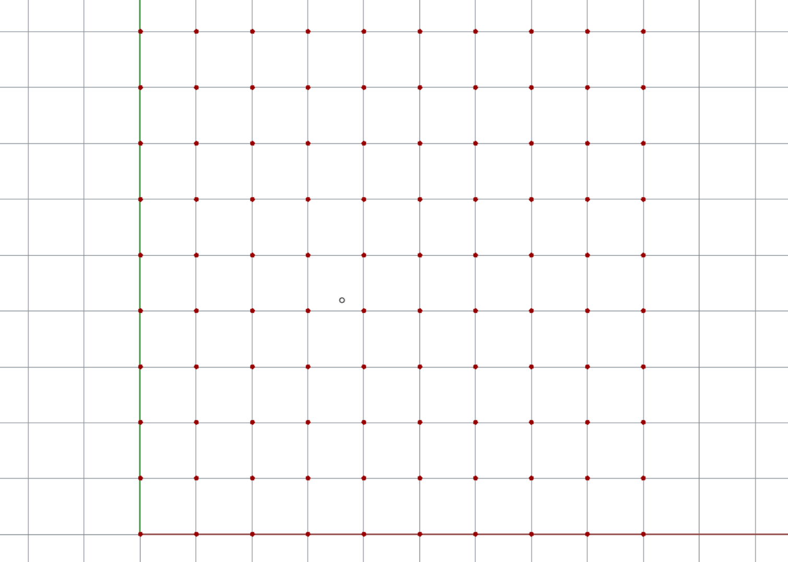
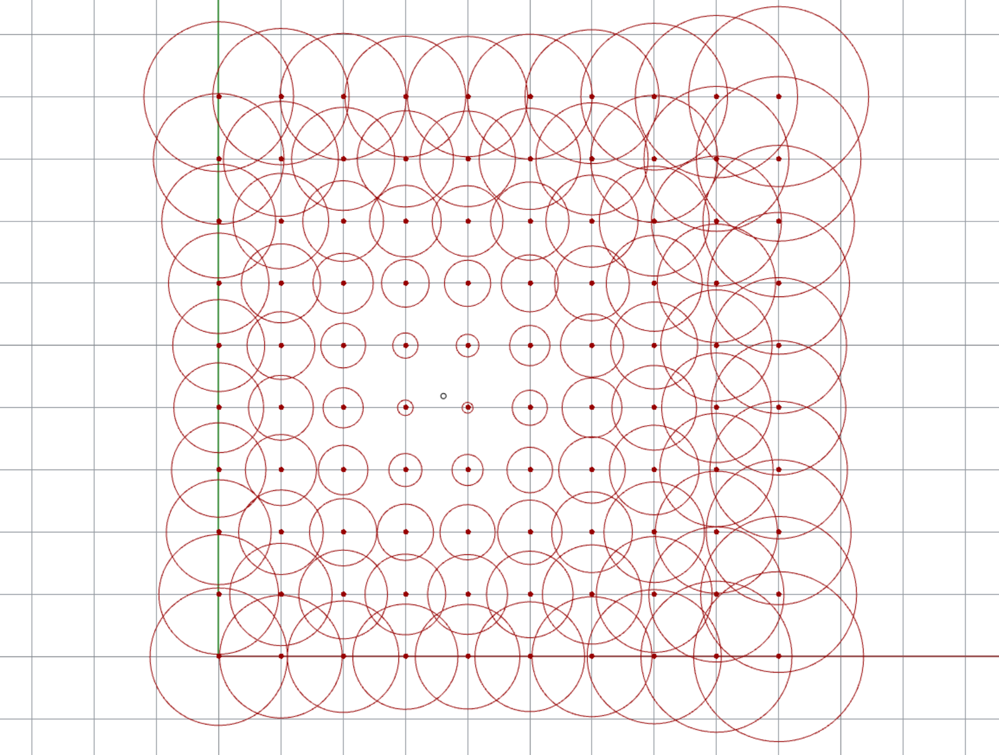
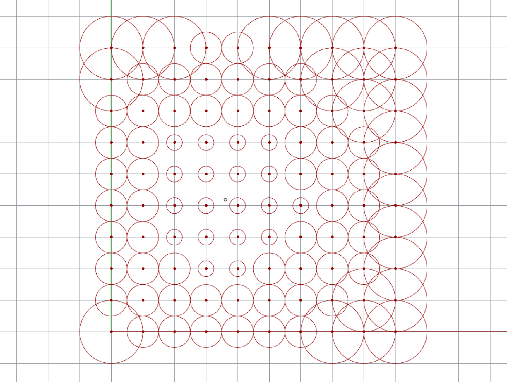
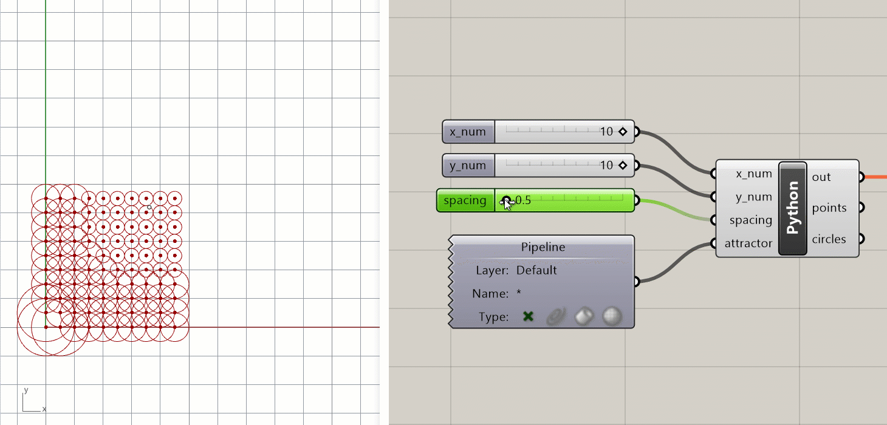

# Setting up your environment

In this tutorial we will develop a simple attractor point model to make sure that our environment is set up and everything is working properly.

Files you will need for this tutorial:

| Start with these files          | In case you get lost, you can download the final solution here |
| :------------------------------ | :------------------------------------------------------------- |
| [0_start.3dm](data/0_start.3dm) |                                                                |
| [0_start.gh](data/0_start.gh)   | [0_end.gh](data/0_end.gh)                                      |

## Introduction

In this class you will use a set of programs and technologies to write your scripts, visualize their results, and submit the results of your work:

- **Rhino**: industry-standard computer modelling software with great support for custom scripting and development
- **Grasshopper**: visual programming environment for Rhino where you can create scripts and automations using an intuitive visual component-based UI
- **Python**: high-level programming language that supports Functional and Object-Oriented programming
- **Github**: version-control software for publishing and contributing to open source projects. Although you can use any git client or use git directly from the command line, I recommend using [Github Desktop](https://desktop.github.com/) which has versions for both [Windows](https://central.github.com/deployments/desktop/desktop/latest/win32) and [MacOS](https://central.github.com/deployments/desktop/desktop/latest/darwin).

### Open the files

To start the tutorial, download the starting Rhino and Grasshopper files using the links above and open them. Make sure you see the "hello world!" message in the yellow `Panel` component. This means that your Grasshopper and Python are working and you have everything you need for this tutorial.



The `Python` component in the start file has already been set up with a set of four inputs which will be accessible within the Python script:

<u>Inputs</u>

- x_num (`int`, "Item Access") - this number specifies the grid's x-dimension
- y_num (`int`, "Item Access") - this number specifies the grid's y-dimension
- spacing (`float`, "Item Access") - this number specifies the grid's spacing
- attractor (`Point3d`, "Item Access") - this point specifies the location of the attractor point. It is set up to automatically reference the point from the Rhino file using a `Pipeline` component.

The `Python` component has also been set up with two outputs which we will populate with data within our script:

<u>Outputs</u>

- points - this will store a list of points representing the grid
- circles - this will store a list of circles generated at each point of the grid

## Attractor point example

Let's develop a simple attractor point model to get an idea of how we will be working with Python inside of Rhino Grasshopper. Double-click on the `Python` component to open the script. You will see that the `Rhino.Geometry` library has already been imported and the two output variables have been initialized as empty lists. Finally, there is a `print()` statement to display the test `hello world!` statement in the console.

```python
import Rhino.Geometry as rh

points = []
circles = []

for x in range(x_num): #remember to set typehint to int
    for y in range(y_num): #remember to set typehint to int
        
        point = rh.Point3d(x*spacing, y*spacing, 0.0) #create constructor
        
        points.append(point) #run method
        
        dist = point.DistanceTo(attractor)
        
        if dist <= 2:
            circle = rh.Circle(point, 0.5)
        if dist > 2:
            circle = rh.Circle(point, 1.0)
        
        circles.append(circle)
```

### Setting up the grid

Let's add some code below the variable initialization to create a 2-dimensional grid of points based on the `x_num` and `y_num` parameters. You can delete or comment out the `print()` statement if you wish.

To create a grid, let's start with a set of loops to iterate over the x and y dimensions of the grid:

```python
for x in range(x_num):
    for y in range(y_num):
```

These loops will give us access to a `x` and `y` variable that designates each coordinate within the grid. Inside the inner `for` loop, let's add code to create a new instance of the `Point3d` class from the `Rhino.Geometry` library at each location in the grid:

```python
        point = rh.Point3d(x, y, 0.0)
```

Finally, let's add each point to the `points` list we initialized as an empty list at the top of the script:

```python
        points.append(point)
```

Click 'Test' to run the script. You should now see a 10x10 grid of points in the Rhino window:



The complete code at this point should look like this:

```python
import Rhino.Geometry as rh

points = []
circles = []

for x in range(x_num):
    for y in range(y_num):
        point = rh.Point3d(x, y, 0.0)
        points.append(point)
```

### Drawing circles

Next, let's draw a circle at each point in the grid. For this we'll use the `Circle` Class in `Rhino.Geometry` to create an instance of a `Circle` centered at the grid point stored in the `point` variable with a default radius of `0.5`. We will also add each instance to the `circles` list so we can see the circles in the Rhino viewport. Add the following lines within the inner `for` loop:

```python
        circle = rh.Circle(point, 0.5)
        circles.append(circle)
```

{: .note }
If you get lost along the way, you can download the complete solution using the link at the top of the page.

### Connecting the attractor point

Finally, let's add some code to make the attractor point control the radius of the circles. Still working within the inner `for` loop, we will first calculate the distance from each grid point to the attractor point. Then, we will use this distance to set a custom radius for each circle. Add two lines of code and modify the `Circle` constructor so that your code looks like this:

```python
import Rhino.Geometry as rh

points = []
circles = []

for x in range(x_num):
    for y in range(y_num):
        pt = rh.Point3d(x, y, 0.0)
        points.append(pt)

        dist = point.DistanceTo(attractor)
        radius = dist / 5.0
        circle = rh.Circle(point, radius)
```

Now run the script and make sure that your results are similar to below. You should see circles of various sizes, with smaller circles closer to the attractor point, and larger circles further away. You can experiment with different calculations on `line 12` to create different circle patterns.



{: .challenge-title }

> Challenge 1
>
> Use one or more conditional statements to assign discrete radius values to the circles based on their distances to the attractor point. For example, circles within a certain distance could be assigned a radius of `0.5` while those further than a certain distance could be assigned a radius of `2.0`.



{: .challenge-title }

> Challenge 2
>
> You may remember that we have an additional parameter called `spacing` being passed into our Python script. For this challenge, add code to the script to make this parameter control the distance between each point in the grid.



```python
## Once you are done, paste your final script code here and create a pull request called:
## 0-your_uni (for example `0-dn2216`)

import Rhino.Geometry as rh

points = []
circles = []

for x in range(x_num): #remember to set typehint to int
    for y in range(y_num): #remember to set typehint to int
        
        point = rh.Point3d(x*spacing, y*spacing, 0.0) #create constructor
        
        points.append(point) #run method
        
        dist = point.DistanceTo(attractor)
        
        if dist <= 2:
            circle = rh.Circle(point, 0.5)
        if dist > 2:
            circle = rh.Circle(point, 1.0)
        
        circles.append(circle)
```

# Working with Github

To submit your work for the challenge at the end of each tutorial, you will use Github. If you've never used Github before, you can think of it as a kind of wiki for managing all the files of a project.

Github is by far the most popular way for developers to collaborate on code-based projects. In a way this is similar to how you might use a cloud storage service like Dropbox or Google Drive to share files with a team. However, Github provides a much more explicit workflow for working with and updating files which creates a legible record of all changes and prevents files being modified by mistake.

### Getting started

If you don't already have a Github account, start by creating one [here](https://github.com/signup).

Once you have an account, use the [Fork me on Github](https://github.com/danilnagy/design-ai/fork) link in the top right corner of this page to create your own fork of the class repository (repo for short). This will allow you to modify the files in the repo (including [the document you are reading right now](https://github.com/danilnagy/design-ai/blob/gh-pages/docs/setup/index.md)) and submit the changes back to the main repo using a pull request (PR for short).

{: .notice }
If you are not familiar with Github or typical git workflows such as branching, forking, and creating pull requests I highly recommend going through the [Getting started tutorials](https://docs.github.com/en/desktop/installing-and-configuring-github-desktop/overview/getting-started-with-github-desktop) for Github Desktop.

### Committing your changes and creating a pull request

Once you've forked the repo, [clone your fork](https://docs.github.com/en/desktop/contributing-and-collaborating-using-github-desktop/adding-and-cloning-repositories/cloning-and-forking-repositories-from-github-desktop) to your computer using Github Desktop. This will create a copy of the repo's files on your computer so you can work with them.

Finally, [edit this file](https://github.dev/danilnagy/design-ai/blob/gh-pages/docs/setup/index.md) and paste in your final script text as described above. Once you're done making edits, [create a commit](https://docs.github.com/en/desktop/contributing-and-collaborating-using-github-desktop/making-changes-in-a-branch/committing-and-reviewing-changes-to-your-project) of your changes. You should include a meaningful commit description describing the changes. Finally, [create a pull request](https://docs.github.com/en/desktop/contributing-and-collaborating-using-github-desktop/working-with-your-remote-repository-on-github-or-github-enterprise/creating-an-issue-or-pull-request#creating-a-pull-request) with the name specified above. This PR will be a record of your submission and will allow me to review your work.
